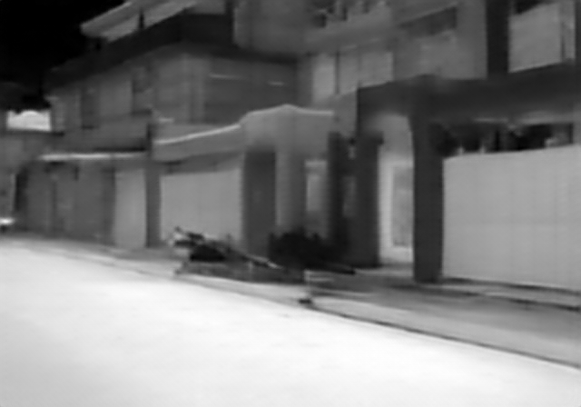

# Thermal Image Super-Resolution · 8×

**Experimental implementations for reconstructing detail in low-resolution thermal images.**

This project explores 8× thermal super-resolution through CNN baselines, residual networks, and GAN-based models, with experiments in edge-aware reconstruction and frequency-domain supervision.

## Explore the repository

| Resource | What you'll find |
| --- | --- |
| [`models/`](models/) | Training scripts for SRCNN, VDSR-style, SRResNet, SRGAN, and Real-ESRGAN-style variants |
| [`inference/`](inference/) | Model-specific inference and evaluation scripts |
| [`output_samples/`](output_samples/) | Saved output images grouped by experiment |
| [`thermal_DINO_loss.py`](thermal_DINO_loss.py) | An additional feature-loss experiment |
| [Detailed technical guide](README%281%29.md) | Architecture notes, loss formulations, configuration, and experimental workflow |
| [Project report](Physics_Aware_Thermal_Super_Resolution.pdf) | The included thermal super-resolution report |

## Technical focus

- Compare L1 and L2 reconstruction objectives in shallow CNN baselines.
- Explore residual upsampling and hybrid reconstruction losses.
- Incorporate Sobel-derived edge information.
- Investigate FFT-based frequency supervision.
- Examine GAN training strategies adapted to thermal imagery.

These are experimental directions represented by the code. The saved examples are qualitative artifacts; they do not establish general benchmark superiority.

## A starting point

1. Read the [technical guide](README%281%29.md) and choose a model family.
2. Inspect the matching script in [`models/`](models/) for dataset locations, dependencies, and training settings.
3. Configure paths for your own low/high-resolution thermal image pairs.
4. Use the corresponding [inference script](inference/) with a compatible checkpoint.
5. Compare outputs using a fixed validation set, PSNR/SSIM, and visual inspection of thermal boundaries.

The repository does not include a complete dataset or trained checkpoint bundle. Some scripts use local paths, so configuring your environment is part of reproducing an experiment.

## Sample output

An output from the edge-injection experiment:

Browse the [output gallery](output_samples/) to compare saved artifacts across model families. Use matched inputs and documented configurations when making quantitative comparisons.

## Next milestones

- [ ] Consolidate dataset paths and model settings into shared configuration.
- [ ] Add a tested dependency specification.
- [ ] Publish comparable input/output panels and evaluation settings.
- [ ] Document checkpoint availability and reproducibility for each experiment.

Built and maintained by [Vansh Joshi](https://github.com/Vansh-A1).

